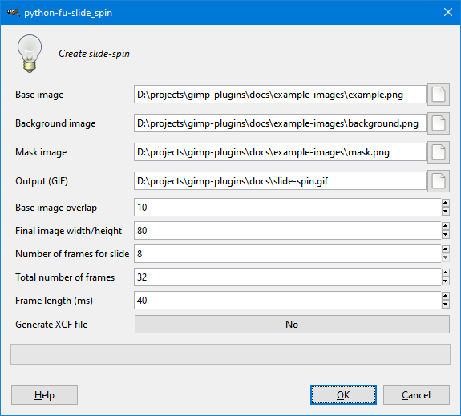
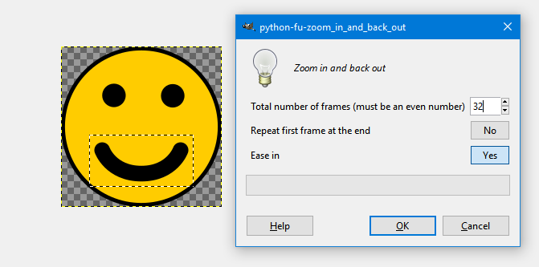

# gimp-plug-ins

Miscellanous plug-ins for [GIMP](https://www.gimp.org/).

## Apply this layer to all other layers

This plug-in copies the contents of the active layer to all other layers. Options:

- Copy the contents above the other layers
- Copy the contents below the other layers
- Copy the contents to the other layers' layer masks (will replace any existing masks)

## Delete all other layers

This plug-in deletes every layer except for the active layer.

## Create slide-spin

This plug-in generates a sliding, spinning object using a base image, background image, and mask image. For best results, use a solid-coloured or patterned background and ensure that the background image's height and width are at least 5 times the size of the base image's width.

## Zoom in and back out

This plug-in generates an animation that zooms in on the selected region of the active layer and then zooms back out.

