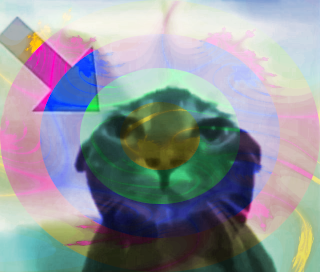
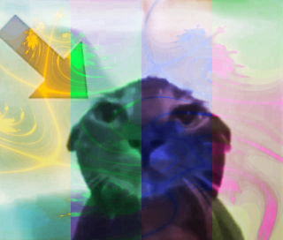
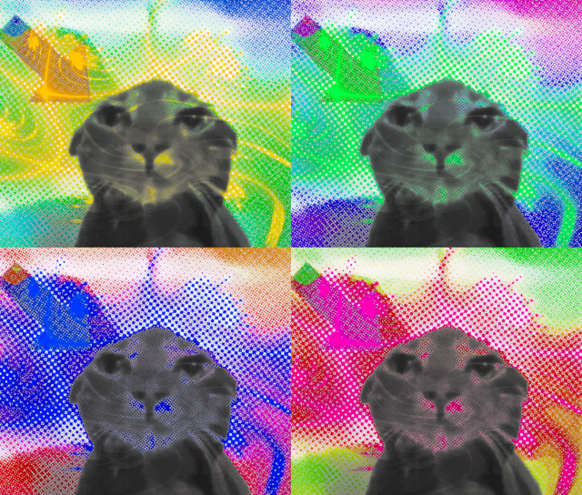
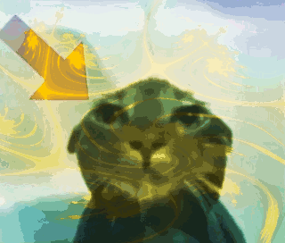
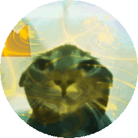
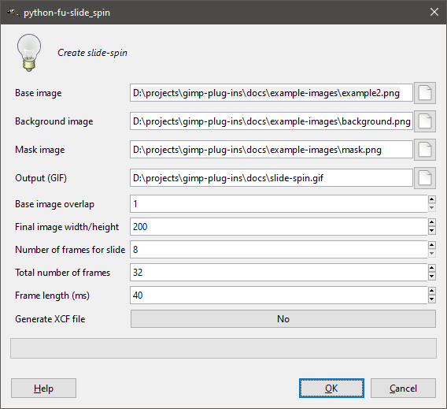
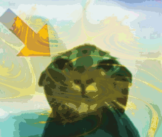
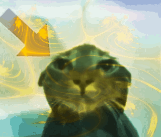

# gimp-plug-ins

Miscellanous plug-ins for [GIMP](https://www.gimp.org/).

## Plug-ins for still images

### Cycle hue radially

This plug-in cycles hue in ellipses from the center of the image.

### Cycle hue in stripes

This plug-in animates cycling of hue in horizontal or vertical stripes.

### Tile and rotate hue

This plug-in tiles an image to the specified horizontal and vertical counts and rotates the hue of each copy.

## Plug-ins for animation

### All layers to image size

This plug-in resizes all layers to the image size.

### Animate layer shift

This plug-in animates layer translation.

### Animate rotation

This plug-in animates layer rotation.

### Apply this layer to all other layers

This plug-in copies the contents of the active layer to all other layers. Options:

- Copy the contents above the other layers
- Copy the contents below the other layers
- Copy the contents to the other layers' layer masks (will replace any existing masks)

### Create slide-spin

This plug-in generates a sliding, spinning animation using a base image, background image, and mask image. For best results, use a solid-coloured or patterned background and ensure that the background image's height and width are at least 5 times the size of the base image's width.

### Cycle hue

This plug-in animates cycling of hue.

### Delete all other layers

This plug-in deletes every layer except for the active layer.

### Duplicate all layers

This plug-in duplicates every layer the specified number of times.

### Duplicate layer

This plug-in duplicates the active layer the specified number of times.

### Merge layers from another image

This plug-in merges each frame of the open file with each frame from another file.

### Zoom in and back out

This plug-in generates an animation that zooms in on the selected region of the active layer and then zooms back out.

